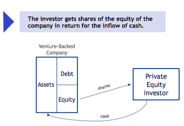
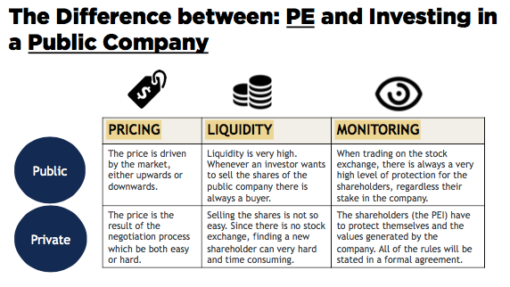
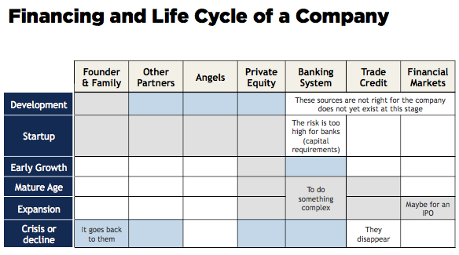
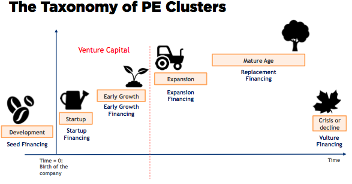
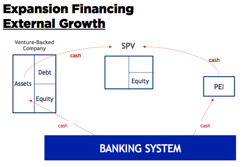
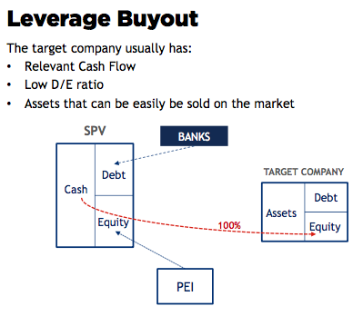

# What is Private Equity and Venture Capital?

## Preliminary Definitions

Two aspects of the Private Equidity (PE):
- PE is **a source of financing**: It is an alternative to other sources of liquidity, (such as a loan or an initial public offering (IPO)) for the company receiving the financing.
- PE is **an investment** made by a financial institution: Private Equity Investor (PEI) in the equity of a non-listed company (i.e. not a public company).

Venture Capital (VC) is a very specific case of PE. It is the investment in the **very early stages** of a company’s life.

## The relationship between the PEI and the VBC

The investor gets shares of the equity of the company in return for the inflow of cash.

## The Consequences the Financing
- A certain and clearly identified reason;
- The issuance of equity on the private market,
- The newly issued shares will be bought by the PEI;
- The investor: a shareholder + the managers of the company
- Create profit only through the generation of *capital gain* 

> The most critical aspect in PE is the **strict relationship** between the investor and the entrepreneur.

## The Difference between: PE and Investing in a Public Company 

# Why Companies Need PE And VC

PE is based on two aspects:
- A source of financing
- An investment

The venture-backed company wants to enjoy some direct and indirect benefits:
- 1. Certification Benefit 
- 2. Network Benefit
- 3. Knowledge Benefit 
- 4. Financial Benefit

## 1. Certification Benefit 
This can give a sign of great health of the company and this high quality can be used as a kind of promotion for the venture-backed company’s brand.

## 2. Network Benefit
The PEI can give the company a very *strong network*, in terms of suppliers, customers and banks therefore multiplying its possible contacts.

## 3. Knowledge Benefit 
- Soft Knowledge: the capability to manage the business
- Hard Knowledge: the specific-field knowledge of a business "high-tech or pharmaceutical industries"

An advisor and mentor

## 4. Financial Benefit

Equity ⬆️  →→ Rating ⬆️  →→ Positive effect on the cost of capital

# Private Equity Clusters: Through the Fund's Life Cycle

The different kinds of PE investment and the accomplishment of the company 

## 1. Development
Seed financing

## 2. Startup
Startup financing

## 3. Early Growth
Early growth financing

## 4. Expansinon
Expansion financing

## 5. Mature Age
Replacement

## 6. Cricis
Vulture financing

The PEI can either be a minority or a majority shareholder:
- Hands-On: Four benefits + operation 
- Hands-Off: Four benefits 

# Seed, Startup, and Early Stage Financing

## Seed Financing

The Seed Financing is the **most complex and riskiest activity** among the PE investment.

- Traits:
 - An (R&D) project
 - Industry-oriented: biomedical, IT, and the pharmaceutical industries / sectors. 
 - Seed financing - uncertaint
 - Trust the idea of the entrepreneur. 
 - The managerial role of the investor is very limited

- Two levels of risk:
 - 1.  The capability for the idea to generate on output
 - 2.  If there is an output: does this output have a market ability?

- Notes
 - 100/10/1 Rule The “psychological threshold” is 1M 
 - Sudden death Risk
 - Size of the Market
 
## Startup Financing
The Startup Financing is the financing of a new company starting its own initial operations.

- Traits:
 - High risk
 - High level of protection for the investor
 - Betting on a business plan
 - Necessary equipment

- Ways of protections:
 - 1.  Put option
 - 2.  Collateral - valuable assets + put option
 - 3.  Stock options - some stock options + profitability of the company
 - 4.  Balance between money and shares: PE owns 95% of the equity, PEI owns 2% of the equity

## Early Stage Financing

Early growth Financing is the financing of the first phase of growth of a new company that has started generating sales.

- Traits:
 - Buy inventory + sustain the gap existing between cash flow and money needed
 - Negative cash flow
 - A very hands-on approach
 - The PEI usually has a high amount of shares in the equity of the company
 - First 3ys on average after the startup stage
 
In this kind of investment, the PEI may also not have any protections, due to the high stake in the equity of the company and to the adoption of a hands on approach.

> **Conclusion on Venture Capital**
- 1. A high level of risk
- 2. A hands on approach
- 3. A very deep knowledge of the field 

# Expansion Financing

# Replacement Financing

Three kinds of operations 
- 1. Leverage Buyout (LBO)
- 2. Private Investment in Public Equity (PIPE)
- 3. Corporate Governance (CG) Deals

## Leverage Buyout (LBO)

## Private Investment in Public Equity (PIPE)

## Corporate Governance (CG) Deals

# Vulture Financing

Two deals
- 1. Restructuring financing (or turnaround) 
- 2. Distressed financing

## Restructuring financing 

## Distressed financing

