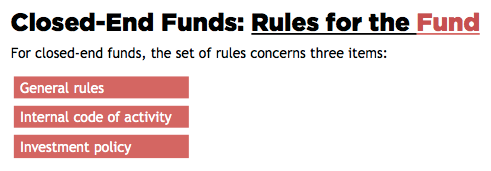
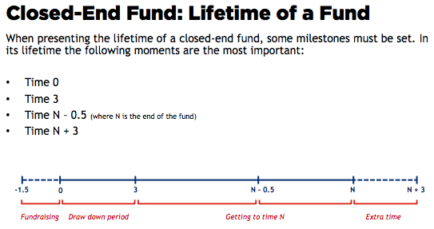
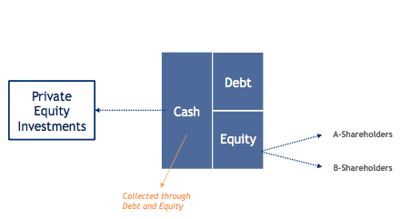
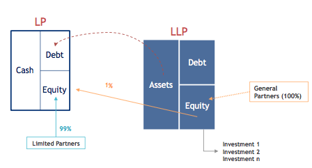
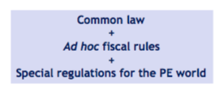
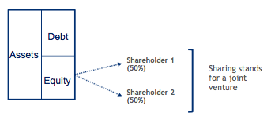
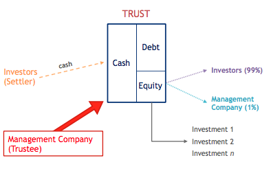
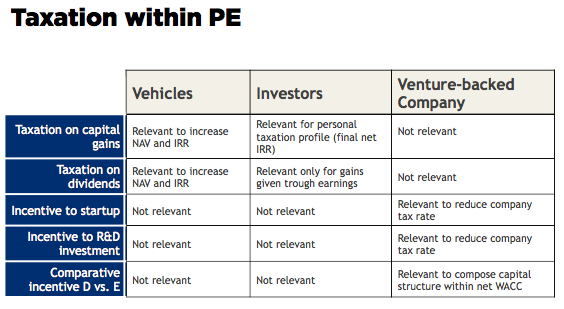

# Modules
- Who can be a PEI
- How an investor works
- How the regulation works for PE
- The remuneration of PE

# Overview
## The Formats
1. The European Union format: This format is regulated by a Directive of the European Union.
 - two Directives regulating PE activity: The Banking Directive & The Financial Services Directive
2. The Anglo-Saxon format: This format is regulated by US and UK laws.
 - In the Anglo-Saxon world, PE is not a financial service (as it is in Europe), rather it is an entrepreneurial activity.

# The European Union World
##  Three vehicles can be a PEI in Europe
1. Closed-End Funds - most suitable player
 - Asset Management Company (AMC)
 - Closed-End Fund
 - Investors
2. Banks  
3. Investment Firms

Notes: Closed end funds have a fixed maturity and a fixed amount of money to invest.

## Rules
For the AMC, the set of **rules** concerns:
- 1. Minimum requirements to operate 
- 2. Governance rules
- 3. Management rules

For the funds, the set of **rules** concerns:

## Lifetime of a Closed-End Fund in Europe

Fundraising - Draw Down Period - Getting to Time N - Extra Time

1.  Year 0-3: first investment
2.  Year 3-5: exit from the first investment
3.  Year 5-7: second investment
4.  Year 7-10: exit from the second investment

## Management Fees and Carried Interest

### Management Fees
- The management fees is a *fixed* percentage of money 
calculated on the value of the closed-end fund in the beginning of the fund itself.

### Carried Interest
- Maximizing the carried interest is the ultimate goal and desire of an AMC.
- CARRIED INTEREST = % x (Final IRR – Hurdle IRR)
- The fixed percentage - 25-30%; the hurdle rate - 7-8%

## Investment Firms and Banks in Europe

### Banks
Banks have to follow very strict constraints and rules.

### Investment firms

- A-shareholders: act as an AMC. management fees + a yearly carried interest
- B-shareholders: profits - the carried interest given to A-shareholders

Investment firms can undertake the same activity as banks with the exception of collecting money through deposits.

# The Anglo-Saxon World

In the Anglo-Saxon markets, it’s can be noted that investments in PE are not regulated by a regulation framework, rather they are *market-related* - the *market discipline* is more powerful and important than a financial authority regulation.

That means PE investment is considered a business activity and not a financial activity as it is in Europe.

## PE Players in the US

1.  Venture Capital Funds (VCFs, funds - most popular)
2.  Small Business Investment Companies (SBICs)
3.  Banks
4.  Corporate Venture
5.  Business Angels

## Limited Partnerships in the US

A fund is just simply a common pool, that means a bank account in which investors put money to be managed all together.

Limited partnership (LP): An LP is one of the typical structures to create a company in the US, whereas common organizational forms are: sole proprietorship, partnership, limited-liability partnership, limited partnership, S-corporation and C-corporation. LPs generally are private investors, banks, pension and insurance funds, and corporate investors; and they are allowed to **leverage**.

Shareholders: the LPs - 99% of the equity of the LP - investors || the General Partners (GPs) - 1% of the entity of the LP - managers

- Europe：a code - a legal battle; a Supervisor || US - a contract, a Limited Partnership Agreement; a Court
- Europe：AMCs, managers; VCFs, investors|| US - GPs, LLP, managers; LPs, investors

> The great success of LPs is due both to 1) the simple scheme of functioning and 2) to the tax transparency - taxes = 0% for a PE investment.

## The regulatory framework of Anglo-Saxon Format

> PE is not a financial service (as it is in Europe), rather it is an *entrepreneurial activity*, and there is no supervisor. 

## SBIC in the US

SBIC 

- the Small Business Investment Company
- two shareholders: a US Public Admin; pure investors; mangement fees + a threshold stated in the SBIC Agreement || the non-public admin investors, a bank, corporation, individual; managers; mangement fees + all the rest of the profits > 50% shares
- 33% of debt, a very low and fixed rate
- the **best** models of PPPs (Public-Private Partnerships)

### Corporate Ventures

not legal entities, promote R&D, outputs, enhance the value for the corporation

### Business Angels

QSBS rule - Qualified Small Business Stock rules, taxes benefits for the seed and start-up financing

### Banks

rare - many constrains

## Funds and VCTs in the UK

1.  Venture capital funds (VCF)
2.  Venture capital trusts (VCT)
3.  Banks
4.  Business Angels
5.  Local PPPs

### Venture Capital Trust

A trust is a very old British institution (there is evidence of the first trusts in the 11th and 12th century) and 
it is an entity, not a company. The trust was born in the first place for succession issues, as a matter of fact through this mechanism the owner (called the settlor) does not have to manage the assets, for a third player will do it (the trustee) and that is fully liable. 
In case the VCT has a maturity, at the end of the VCT the owner gets back the assets belonging to the trust.

Investors; Settlors || Managers, Management Company; Trustee

# Taxation

## Taxation within PE

### Taxation on Capital Gains for the VEHICLES

- Participation Exemption (PEX) - a threshold, lower 

- Flat tax: It works like the PEX, only without any conditions. The tax rate is lower that the tax rate in the country (like for Close-end Funds in Europe for which the tax rate is 20%).

- Tax Transparency:

### Taxation on Capital Gains for the INVESTORS

|   | Demestic    |  Foreign  |
|---|---|---|
| Private Individual  |   |   
| Legal Entity  |   |   

## Taxation on Dividends

the same rules

## Incentives to R&D and Startups

- Mark Down: 3 years tax 0%
- Shadow Costs
- Tax Credit

## Taxation and Incentives to D/E Ratio

- Thin Cap
- Double Income Taxation
