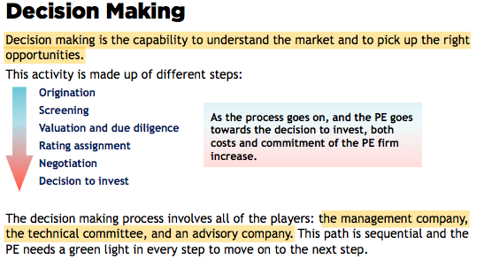
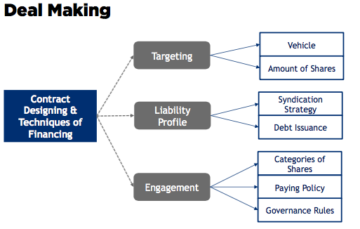
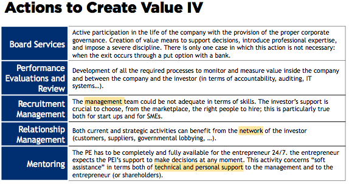
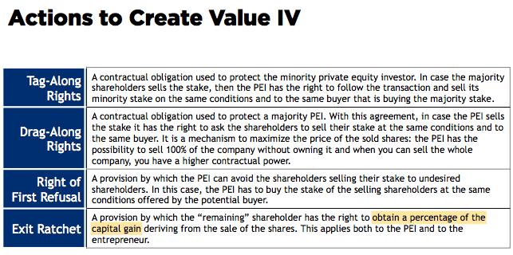
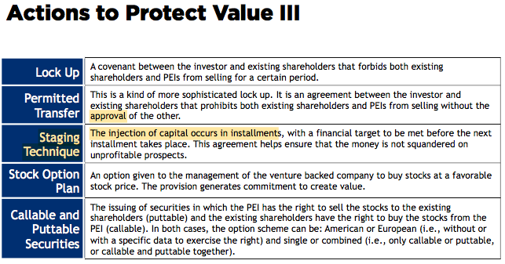

# The Managerial Process for Equity Funds

The managerial process is the *day-by-day* activity of the *managers* managing the investment made by the *investors*.
When highlighting the characteristics of the managerial process, 
both academia and practitioners consider this process as made up of four steps:
- 1. Fundraising - 1.5y in EU vs 1y in US
- 2. Investment activity - evaluation & managment
- 3. Managing and Monitoring - ensure the creation of *value*
- 4. Exiting - most important by *generating a capital gain*

>The exiting moment is in the end the reason **why managers do PE activities**, 
that is they have to understand **when** (and **if**) they will be able to exit.

# Fundraising

Fundraising is a selling game about the business idea in which *reputation*, mutual trust, and love for risk are the pillars.
The proposal is basically a business idea that leads to the creation of a vehicle to invest in private equity to produce value that will be spread among the promoters- managers and the investors.

The typical fundraising activity steps are as follows:
- 1.  Business Idea Creation 
- 2.  Job Selling
- 3.  Raising Debt
- 4.  Closing

## Business Idea Creation

The information memorandum has to explain the rationale of the *business idea* which is strictly linked to 
the *reputation* and to the track record of the promoter to the business community

Internal code of activity in EU vs LPA's contract in US

## Job Selling

The *letter of commitment* via one-to-one meetings between the promoters and the potential counterparts

## Debt Raising

Only accurs in the US and in the UK 

The goal is to sell a project to a community of financers and it is difficult for each counterpart (the investors and the banks)
to make the first move. Still the reputation is important.

## Closing

A "successful" closing occurs based on it reputation and the purpose of the initiative or a "pure" closing without any money collection.

# Investing: The Decision Making Phase

Investing involves in two different important moments:
- Decision-Making: valuation and selection
- Deal-Making: negotiation of the contracts about the *rules*

## Decision Making

Decision making is the capability to understand the market and to pick up the **right opportunities**, involving in the the management company, the technical committee, and an advisory company.

## Origination

The PE must decide the *destination* of the money collected, and scout the market.

## Screening

100/10/1 rule in startup 

managers + technical committee

## Due Diligence and Valuation

The analysis of the business plan - long time

## Rating Assignment

Assess the level of risk and understand the debt

## Negotiation

The negotiation with the entrepreneur to calculate the numbers of shares a PE owns and the stake 

## Decision to Invest

The managers: the GPs vs the directors in an AMC in EU

The beginning of the second part of the investing phase: Deal making.

# Investing: The Deal Making Phase

The deal making activity is related to the *financial* and *legal issues* related to the investment in the venture-backed company, finding the right balance between the *need of money* of the company and the *expectation of IRR and capital gain* for the PE investors.

Finding the right balance is not easy and the whole process is based on three pillars:
- 1.  Targeting
- 2.  Liability profile
- 3.  Engagement

## Deal Making flow

## Targeting

### 1. The Vehicle

A direct investment or in an indirect investment with the SPV - convincing the banking system

### 2. The Amount of Shares

Majority versus minority, Relative and absolute *size* of investment, 
Capital requirement impact, *Voting rights* and effective influence within the board of directors

## Liability Profile

### The Syndication Strategy

Share the risk borne otherwise only by the PE firm

### Debt Issuance

A very hands-on approach towards the venture-backed company, involving the negociation with the banking system

## Engagement

The PE firm has to set up the **rules** by which a PE can govern the venture-backed company. 

### Categories of Shares

Typical choices: Common shares, Shares with limited or increased rights, 
Shares with embedded option: for instance a share with a put option allowing the PE to sell the shares under some particular circumstances, Tracking stocks

### Paying Policy

To address related to the fact that a PEI is buying another company’s shares.

>The main activity of a PEI is to finance a company.

### Governance Rules

Numbers of directors, Can the PEI sitting on the board of directors, The scheduling of the board meetings

# Managing and Monitoring: Supporting the Company

## Managing & Monitoring
- Actions to **create** and to measure value
- Rules to **protect** the created value

Enhance the value of the company(shareholders + investor)

## The nature of this presence depends on:
- The *stage* of the investment 
  - seed and start up: industrial and strategic
  - expansion and replacement: financial and legal issues
- The *style* of the investor and the nature of the investment agreement
  - The hands-on approach: financial and strategic decisions
  - The hands-off approach: financial decisions
  
## The key activities to create value 

# Managing and Monitoring: Covenants Usage

Protect the *divergence* of opinions between the entrepreneur and the PEI and the *risk* of struggle that may derive from it.

## The typical covenants 

# Exiting

> Exiting is the most **difficult** step for a PEI, because there exists both a *pricing* and a *liquidity* issue.

Exiting strategies have to be contextualized according to the *portfolio strategy* of the PEI. There is in fact a double perspective where the IRR of the investment has to be coordinated with **goals** and **constraints** coming from the whole portfolio.

Note: Theory and market trends show there is **no correlation** between: the stage of investment, the holding period and the exit way strategy.

The typical exiting strategies are the following:
- 1.  Trade sale
- 2.  Buy back
- 3.  IPO or sale post IPO
- 4.  Sale to other private equity investors 5.  Write off

## 1. Trade Sale

- Based on the industrial relation
- Not very widespread
- Common in LBO, the PE holds the drag along right & in PIPEs

## 2. Buy Back

This option to exit gives for granted the fact that the entrepreneur has got *liquidity enough* to buy the shares.

One of the most used covenants in these cases is the puttable shares.

## 3. IPO

- The best option a PEI could ever dream of. I
- A PEI can maximize the capital gain
- Only in 1% of the cases
- Saling its stake in the stock exchange
- Difficult but must be ready for it "bubbles"

## 4. Sale to Another Private Equity Investor

Common in the American market and is based on strong relationship between PEI and the community of PEIs.

## 5. Write Off

The worst nightmare of a PE

# Private Equity Advice for Entrepreneurs

> The chemistry and the personal relation between the PE and the entrepreneur is fundamental to make the partnership successful. 
—— Prof. [Fabio Sattin](http://www.privateequitypartners.com/sattin.php)
