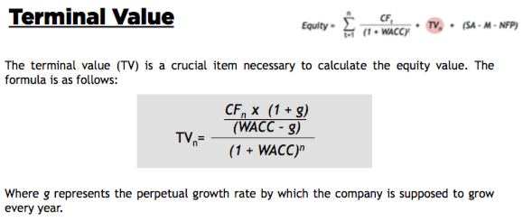
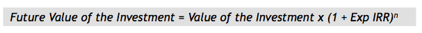

# Company Valuation Fundamentals

## Company valuation

Company valuation is the assessment of company’s value.
Concerning PE, company valuation is a *fundamental step* since the PEI needs to know 
the value of the company in which it is investing to decide to buy either *newly issued shares* or already *existing*.

Two moments are related to the generation of IRR:
- Time 0: minimize EV
- Time N: maximize EV

## A Balance Sheet in company valuation

## Equity Value: The Pillars for Company Evaluation

The most popular way for calculating the equity value is represented by **discounted cash flow** (DCF), 
where the rationale behind this model lies the assumption that the value of the company is made up by the present value of the *cash flows* (CF) that 
the company will generate over the following years discounted at the **weighted average cost of capital** (WACC).

## Equity Value Calculation

- TV is the terminal value at time n
- SA are surplus (non-operating) assets
- M represents the equity held by minority shareholders
- NFP is the net financial position
- SA, M and NFP refer (if they exist) to the time in which the valuation is made

## Multiplies

### EV/EBITDA
Enterprise value/EBITDA gives a strong advice about “How many times do you have to multiply the EBITDA to buy the company?” 
It is based on the capability of the firm to produce gross margin.

### EV/EBIT
Enterprise value/EBIT gives a strong advice about “How many times do I have to multiply the EBIT to buy the company?” 
It is based on the capability of the firm to produce operating profit.

### EV/S
Enterprise value/sales gives a strong advice about “How many times do I have to multiply the sales to buy the company?” 
It is based on the capability of the firm to produce sales.

# Company Valuation Fundamentals: The Pillars of DCF

The DCF is based on the generation of cash flow.

## Cash Flow

### Profit and Loss (or income) Statement 

### Cash Flow
>

This is the *most widespread* way to calculate the Free CF for the firm.

## WACC

### WACC 

### WACC: The Cost of Debt
>

### WACC: The Cost of Equity

>

When a company is not listed, it is necessary to compute the beta using the data of the comparable companies. 
Here follows the steps:
- 1.  Identification of the beta of a comparable (one or more)
- 2.  Deleveraging of the beta with comparable companies data
- 3.  Re-leveraging of the beta using the target company data

> 

## Terminal Value

## Surplus Assets, Minorities, and NFP

# A Case of Company Valuation for PE Investment

 

# Applying Company Valuation to PE Settings

As a matter of fact the PEI wants the equity value to be as *low* as possible in the beginning of the investment 
while the value has to be as *large* as possible by the end of the investment.

## Inputs from the business plan

(Expected EBITDA multiple at exit) * EBITDA = EV

Enterprise Value = EV - Net Financial Position

A sensitivity analysis matrix: 
PEI combines the *EBITDA multiples* and the *holding period*

# Applying Company Valuation to VC Settings:The VC Method

## The Venture Capital Method steps

The venture capital method (VCM) focuses on the relation among 
1) the expected IRR, 2) the growth of the firm and 3) the percentage of shares the PEI.

- This approach can be used as
 - For deals where the phase of price setting is fundamental
 - For seed and startup deals in where it is difficult to determine the percentage of investment for the equity investor.

- Five steps of the VCM
 - Step 1: The future value of the investment
 - Step 2: The TV calculation
 - Step 3: The percentage of shares the PEI will own after the investment 
 - Step 4: The amount of share the VBC has to issue
 - Step 5: The value of the newly issued shares

## Step 1: The Value of the Investment

 

## Step 2: TV Calculation

 

## Step 3: The Percentage of Shares

 

## Step 4: The Number of Shares to Be Issued

 

## Step 5: The Value of Newly Issued Shares

 

# Launching Your Own Startup: Suggestions

## Favorable Conditions

- The huge amount of liquidity available 
- A wide spread interest in alternative investments
- A need for growth to enhance the GDP

## Rules of a Well-Organized Startupper

- 1. Commitment, hard work, and passion
- 2. Right team
- 3. Promotion of a glamorous idea
- 4. **Numbers, numbers, numbers**!!!
- 5. Be a risk lover
- 6. Be able to make other people commit

## Final Recommendations

Select the **most suitable** one for your project and needs.

> It is important that you want to select the investor that really makes sense for 
your background, for your study, for your ideas, and especially for *your future*.
—— Prof. [Stefano Caselli](http://faculty.unibocconi.eu/stefanocaselli/) 

